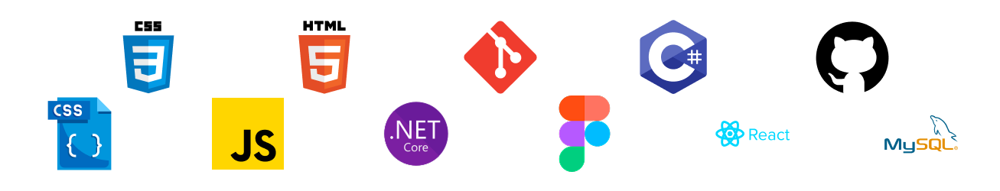

## About me

Hi there! I’m Ashedzi — a UI/UX Designer and Software Developer who loves creating smooth, easy-to-use 
digital experiences. With a background in Computer Science and hands-on experience in both 
design and development, I enjoy bringing ideas to life through code and visuals.

I like tackling challenges head-on and figuring out smart, creative ways to solve problems. My goal is 
always to make something that not only works, but feels right to use.

I’m ready to start my career as a Junior Software Developer, combining my design and coding skills 
to build projects that matter — and keep learning along the way.

Interested in working together? Contact me at solomonashe84@gmail.com. 
I look forward to hearing from you.

### My skills

  &nbsp;
  &nbsp;
  &nbsp;
  &nbsp;
  &nbsp;
  &nbsp;
  &nbsp;
  &nbsp;
  &nbsp;

### Ashedzi's GitHub Stats

### My Most Used Languages

##

<!---

<!--
**ashedzi/ashedzi** is a ✨ _special_ ✨ repository because its `README.md` (this file) appears on your GitHub profile.

Here are some ideas to get you started:

- 🔭 I’m currently working on ...
- 🌱 I’m currently learning ...
- 👯 I’m looking to collaborate on ...
- 🤔 I’m looking for help with ...
- 💬 Ask me about ...
- 📫 How to reach me: ...
- 😄 Pronouns: ...
- ⚡ Fun fact: ...
-->
